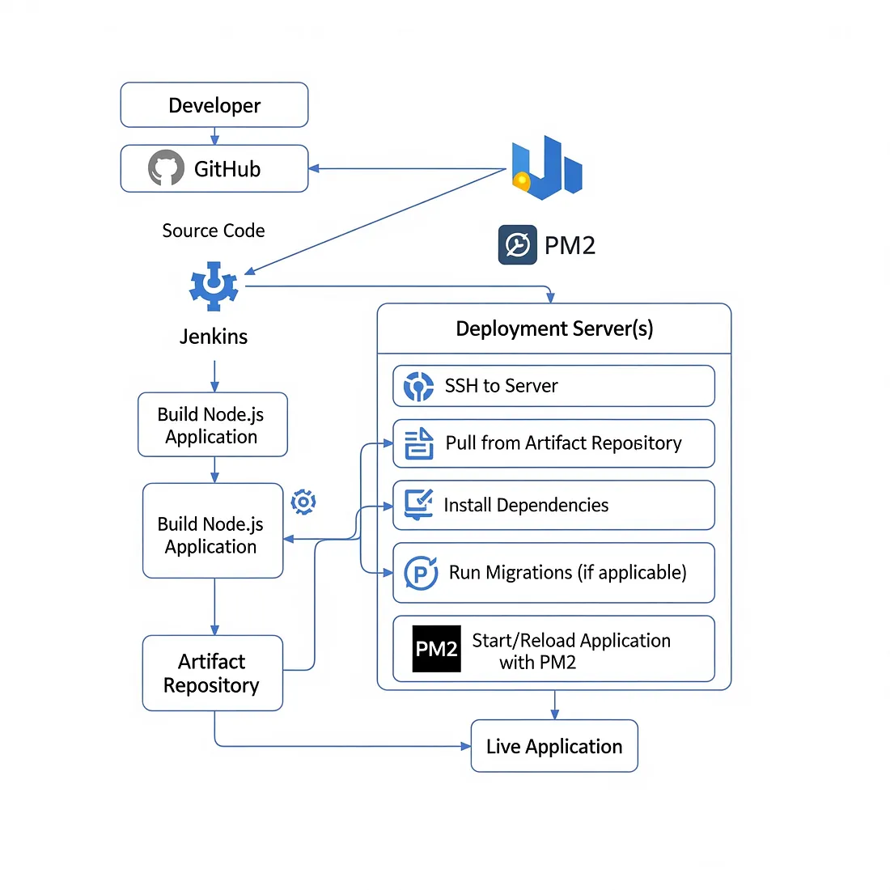

# 🚀Complete Guide: Node.js Deployment on Jenkins Using Freestyle Project

Automating your Node.js application deployment with Jenkins helps you deliver updates quickly, reliably, and consistently. This tutorial will walk you through setting up Jenkins freestyle projects to pull your code from GitHub, install dependencies, and deploy your Node.js app using pm2.

<hr>

__Architecture Diagram__



* Jenkins running the pipeline jobs.
The GitHub repo hosts your Node.js application code.
* pm2 ensures your app runs continuously and restarts on failure.
* The application is accessible externally on __port 3000__.  
<hr>

### Prerequisites
Before you start, make sure you have the following in place:
* A __Linux server__ (Ubuntu/Debian recommended) with Jenkins installed and running. Jenkins runs as a dedicated user (jenkins).

* Jenkins user has __sudo privileges__ so it can install software and manage processes.
* __Git plugin__ installed in Jenkins.
* Node.js application source code hosted on a Git repository (e.g., GitHub).
* Open Jenkins web UI port (default ___8080___) accessible via your security groups.
* Open your Node.js application port (e.g., ___3000___) in security group to allow external access.
<hr>

### Setting Up Jenkins Freestyle Project
We will create four Jenkins freestyle jobs to automate the deployment pipeline:

* Job-1: ___setup-env___: install node, npm and pm2(globally)
      
* job-2: ___node-pull-repo___: Pull latest source code from Git.

* job-3: ___node-install-deps___: Install Node.js dependencies (npm install).

* job-4: ___node-deploy-app___: Deploy/start the Node.js application using PM2.
<hr>

### Job-1: setup environment
* Click New Item.
* Enter name: `setup-env`.
* Choose Freestyle project, click OK.

.png)

* __Bulid Steps__ > __Execute shell:__
```
sudo apt install nodejs -y
sudo apt install npm -y
sudo npm install -g pm2
```

.png)

* __Add Post-bulid Action__ > __Bulid other project__
  
  - Enter downstream job's name: `node-pull-repo`

  - Then click save


<hr>

### Job-2: Pull repo from github
* Click New Item.
* Enter name: `node-pull-repo`.
* Choose Freestyle project, click OK.

* Scroll to Source Code Management, select __Git__.
* Enter your Git repository URL, e.g.: [https://github.com/abhigiri07/node-app-deploy-jenkins.git](https://github.com/abhigiri07/node-app-deploy-jenkins.git)

* __Branch:__ `main`(or whatever your default is)

.png)

* __Add Post-bulid Action__ > __Bulid other project__
  
  - Enter downstream job's name: `node-install-deps`

  - Then click save

<hr>

### Job-3: Install Dependencies
* Click New Item.
* Enter name: `node-install-deps`.
* Choose Freestyle project, click OK.

* __Bulid Steps__ > __Execute shell:__
```
cd /var/lib/jenkins/workspace/node-pull-repo
sudo npm install
```
.png)

* __Add Post-bulid Action__ > __Bulid other project__
  
  - Enter downstream job's name: `node-deploy-app`

  - Then click save
  
<hr>

### Job-4: Install Dependencies
* Click New Item.
* Enter name: `node-deploy-app`.
* Choose Freestyle project, click OK.

* __Bulid Steps__ > __Execute shell:__
```
cd /var/lib/jenkins/workspace/node-pull-repo
pm2 start app.js --name node-app || pm2 restart node-app
```
.png)

* __Add Post-bulid Action__ > __Bulid other project__
  
  - Enter downstream job's name: `node-deploy-app`

  - Then click save

<hr>

### Running the Pipeline
1. Go to Jenkins dashboard.
2. Click on __setup-env__.
3. Click __Build Now__.
4. This will trigger the downstream jobs in order:
   * __setup-env__ (install node, npm and pm2)
   * then __node-pull-repo__ (pull code),
   * then __node-install-deps__(install dependencies),
   * then __node-deploy-app__(deploy app).

.png)
<hr>

### Access Application
open browser and go to

```
http://<Public-IP>:3000
```
.png)
<hr>

### Conclusion
By setting up Node.js deployment on Jenkins using freestyle projects, you’ve built a simple yet effective Freestyle pipeline that automates pulling code from a repository, installing dependencies, and deploying the application with pm2.

This approach not only saves time but also reduces human errors, ensuring your application is always up-to-date and running smoothly. While freestyle projects are great for getting started, you can later upgrade to Jenkins Pipeline as Code for more flexibility, scalability, and better maintainability.

With the right automation in place, you can focus more on building features and less on managing deployments — turning ideas into running applications faster than ever!

<hr>
